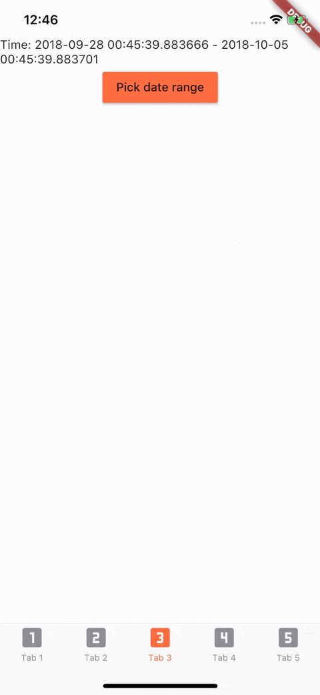

<a href="https://stackoverflow.com/questions/tagged/flutter?sort=votes">
   
</a> <a href="https://pub.dartlang.org/packages/date_range_picker"></a>

# [Deprecated] Date Range Picker

Currently Flutter has supported date range picker, so I think my mission is done. Thanks for using my lib.
Link: https://api.flutter.dev/flutter/material/showDateRangePicker.html

## Demo



## Getting Started

### Installation

Add to `pubspec.yaml` in `dependencies` 

```
  date_range_picker: ^1.0.5
```

### Usage
```
import 'package:date_range_picker/date_range_picker.dart' as DateRagePicker;
...
new MaterialButton(
    color: Colors.deepOrangeAccent,
    onPressed: () async {
      final List<DateTime> picked = await DateRagePicker.showDatePicker(
          context: context,
          initialFirstDate: new DateTime.now(),
          initialLastDate: (new DateTime.now()).add(new Duration(days: 7)),
          firstDate: new DateTime(2015),
          lastDate: new DateTime(DateTime.now().year + 2)
      );
      if (picked != null && picked.length == 2) {
          print(picked);
      }
    },
    child: new Text("Pick date range")
)
```
### Theme Customization

To change the colors to your preferred ones, you can wrap it in a Theme and a builder.

```
Theme(
    data: Theme.of(context).copyWith(
        accentColor: Colors.green,
        primaryColor: Colors.black,
        buttonTheme: ButtonThemeData(
        highlightColor: Colors.green,
        buttonColor: Colors.green,
        colorScheme: Theme.of(context).colorScheme.copyWith(
            secondary: Colors.red,
            background: Colors.white,
            primary: Colors.green,
            primaryVariant: Colors.green,
            brightness: Brightness.dark,
            onBackground: Colors.green),
            textTheme: ButtonTextTheme.accent)),
            child: Builder(
                builder: (context) => RaisedButton(
                    color: Color.fromRGBO(212, 20, 15, 1.0),
                    shape: RoundedRectangleBorder(borderRadius: BorderRadius.circular(30.0)),
                    child: Padding(
                        padding: const EdgeInsets.only(top: 10.0, bottom: 10.0, left: 30.0, right: 30.0),
                        child: Text(
                          "Date Picker",
                          style: TextStyle(
                            color: primaryColor,
                            fontSize: 28,
                            fontWeight: FontWeight.w300,
                          ),
                        ),
                      ),
                      onPressed: () async {
                        final List<DateTime> picked = await DateRangePicker.showDatePicker(
                            context: context,
                            initialFirstDate: new DateTime.now(),
                            initialLastDate: (new DateTime.now()).add(new Duration(days: 7)),
                            firstDate: new DateTime(2015),
                            lastDate: new DateTime(DateTime.now().year + 2));
                        if (picked != null && picked.length == 2) {
                          print(picked);
                        }
                      },
                    ),
                ),
            )
```
